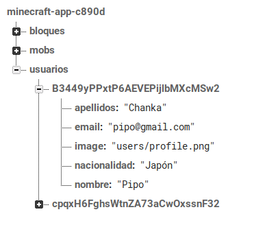
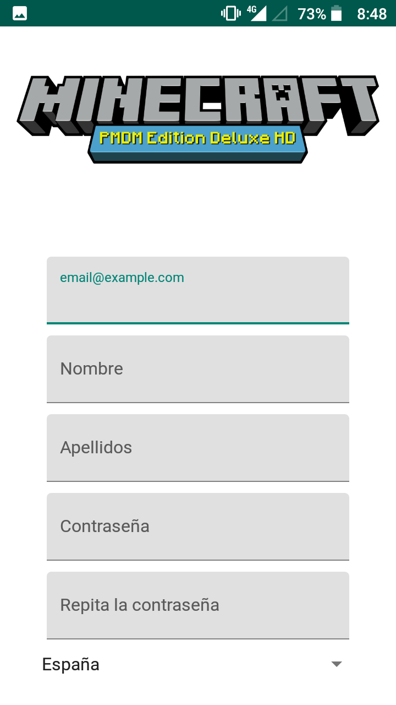

# MinecraftApp

## Base de datos

## Login

La primera pantalla de la app es el login, el usuario es tu email y hay un botón par acceder al registro.

## Registro

En el registro hay que rellenar todos los campos y las contraseñas deben ser iguales para poder registrar un usuario nuevo.

Al completar el registro, se regresa a la pantalla de login automáticamente.

## Página principal

La página principal muestra el logo y una descripción de la app (lorem ipsum).

## Bloques

La parte de los bloques es un recycler que coge los datos de firebase database y las imágenes de firebase storage.

## Mobs

La parte de los mobs es otro recycler que coge los datos de firebase database y las imágenes de firebase storage.

## Menú Principal

El menú principal tiene 2 opciones, salir de la app e ir al perfil.

## Perfil

La pantalla de perfil muestra los datos del usuario logueado.

Para volver a la actividad principal está el botón al lado del icono de la app en la barra de accion superior.

### Editar perfil

Al clicar en el botón de editar, se habilita la edición del nombre, apellidos y nacionalidad del usuario.

Si no quieres guardar los datos editados pulsas en el botón de cancelar y se deshabilita la edición de los datos.

Si clicas en guardar se actualizan los datos en la base de datos y en la pantalla de perfil.

### Borrar perfil

Para eliminar tu cuenta de la aplicación, está el botón de "borrar cuenta", el cual abre una alerta para confirmar el borrado.

Si se cancela solo se cierra la alerta, pero si confirmamos el borrado de la cuenta, se borra la misma y nos devuelve a la pantalla de login.

